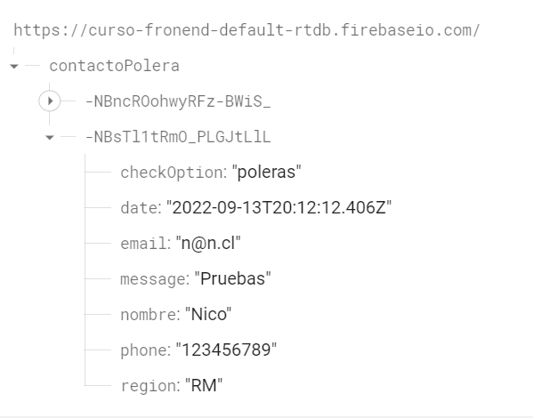

# Actividad 1 - Entrega 1 Trabajo Final

## Link https://nicneira.github.io/Actividad1AIEP/index.html

## Se requiere
Desarrolle de manera individual o en parejas un sitio web de tema libre que contemple al menos lo siguiente:

1. ✅ Al menos 2 páginas HTML (ej. Inicio, Toma de Horas, Nosotros, Suscripciones, Biografía, Contacto, Bibliografía, Galería de Imágenes, Videos, etc). Utilice como mínimo las siguientes etiquetas: de título (h1..h6), div, main, header, footer, img, p, form, input, option, select, button, table y video. 
2. ✅ Validar el código HTML y CSS de cada una de las páginas en la W3C
3. ✅ El código HTML, CSS y JS debe ser ordenado, es decir, use indentación, saltos de línea, nombres de ID y clase entendibles, nombres de variables y funciones, bloques, etc. 
4. ✅ Utilice los siguientes componentes de Bootstrap como mínimo: Navbar, Carousel 
5. ✅ Utilice CSS para personalizar colores, espaciado y tipografía
6. ✅El código fuente debe estar en un repositorio GIT en la plataforma de Github de manera pública. Debe documentar claramente en su archivo README.md al menos lo siguiente: el contexto del proyecto, los requerimientos y las versiones de las librerías o frameworks utilizados.
7. ✅ El proyecto debe ser expuesto y funcional a través de Github Pages

# Actividad 2 - Entrega 2 Trabajo Final

## Se requiere
Desarrolle de manera individual o en parejas un sitio web de tema libre que contemple al menos lo siguiente:

1. ✅ Al menos 4 páginas HTML (ej. Inicio, Toma de Horas, Nosotros, Suscripciones, Biografía, Contacto, Bibliografía, Galería de Imágenes, Videos, etc). Utilice como mínimo las siguientes etiquetas: de título (h1..h6), div, main, header, footer, img, p, form, input, option, select, button, table y video.
2. ✅ Al menos 1 formulario con 5 campos para el ingreso de datos, utilice controles diversos como por ej: input, radios, checkbox, textarea, entre otros
3. ✅ Validar el código HTML y CSS de cada una de las páginas en la W3C
4. ✅ El código HTML, CSS y JS debe ser ordenado, es decir, use indentación, saltos de línea, nombres de ID y clase entendibles, nombres de variables y funciones, bloques, etc.
5. ✅ Utilice los siguientes componentes de Bootstrap como mínimo: Navbar, Carousel y Alerts
6. ✅ Utilice CSS para personalizar colores, espaciado y tipografía
7. ✅ El sitio en su totalidad debe ser responsivo, se probará usando las herramientas de desarrollo del browser. Se recomienda utilizar un acercamiento Mobile First.
8. ✅ Debe validar cada campo del formulario usando Javascript. Se solicita validar cada campo al ser modificado y en conjunto al pinchar el botón final.
9. ✅ Los datos de los formularios deben tener coherencia y ser persistidos en alguna plataforma externa como Firebase
10. ✅ El código fuente debe estar en un repositorio GIT en la plataforma de Github de manera pública. Debe documentar claramente en su archivo README.md al menos lo siguiente: el contexto del proyecto, los requerimientos y las versiones de las librerías o frameworks utilizados.
11. ✅ El proyecto debe ser expuesto y funcional a través de Github Pages

## Contexto del proyecto
El proyecto a continuación se trata de una pagina web enfocada en la serigrafia de poleras y los diseños de esta, tendra 5 secciones las cuales son:
- ✅ **Inicio:** Tipo Landing Page con info general
- ✅ **Productos:** Poleras y diseños creados
- ✅ **Nosotros:** Acerca de la empresa, su vision y politica
- ✅ **Contactanos:** Formulario de contacto y ubicacion de la empresa
- ✅ **Preguntas Frecuentes:** Sección dedicada a preguntas frecuentes

## Librerías o frameworks utilizados
- Bootstrap v5.2.0
- jQuery 3.6.1 compressed version

## Cosas a mejorar
- Mejorar validaciones del formulario (ej: cantidad en numeros de telefono)
- Paleta de colores
- imagenes e interactividad
- contenido de pagina productos

## Validaciones en W3C y Persistencia en firebase

